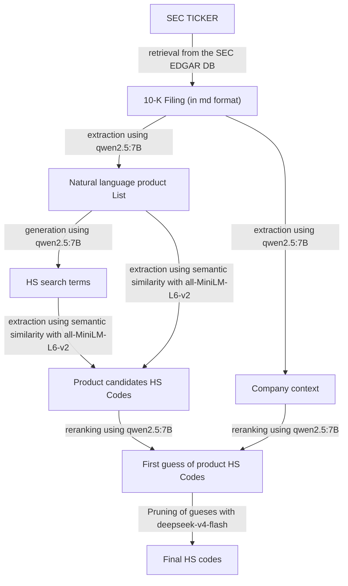

# SEC-10k to HS Codes pipeline

```mermaid
flowchart TD
    TCK["SEC TICKER"] -->|retrieval from the SEC EDGAR DB| 10K["10-K Filing (in md format)"]
    10K -->|extraction using qwen2.5:7B| PL["Natural language product List"]
    10K -->|extraction using qwen2.5:7B| CTX["Company context"]
    PL -->|generation using qwen2.5:7B| ST["HS search terms"]
    ST -->|extraction using semantic similarity with all-MiniLM-L6-v2| CDD["Product candidates HS Codes"]
    PL -->|extraction using semantic similarity with all-MiniLM-L6-v2| CDD["Product candidates HS Codes"]
    CDD -->|reranking using qwen2.5:7B| RR["First guess of product HS Codes"]
    CTX -->|reranking using qwen2.5:7B| RR
    RR -->|Pruning of gueses with deepseek-v4-flash| FL["Final HS codes"]

```